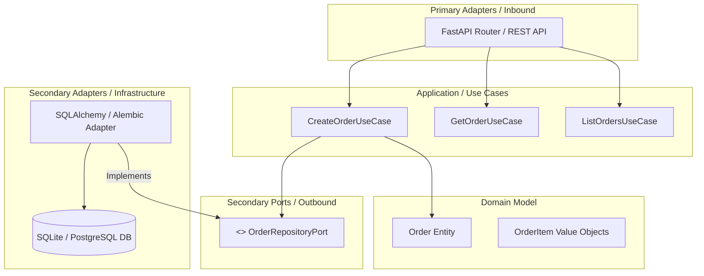

# Orders Service - Microservicio de Gestión de Órdenes

Microservicio robusto desarrollado en Python para la gestión de órdenes de compra, implementado bajo **Arquitectura Hexagonal (Puertos y Adaptadores)** y **Principios de Arquitectura Limpia**[cite: 7, 8, 10].

## Arquitectura del Proyecto

El sistema está estructurado en capas independientes para garantizar desacoplamiento y testabilidad:

## Estrategia de Capas:

   - Domain: Entidades puras, lógica de negocio y reglas de validación sin dependencias externas.

   - Application: Casos de uso que orquestan el flujo de información entre el dominio y los puertos.

   - Infrastructure: Implementaciones concretas de almacenamiento (SQLAlchemy Core/ORM, migraciones Alembic)

   - API: Adaptadores de entrada FastAPI con esquemas de validación Pydantic v2.

## Tecnologías y Herramientas

- Lenguaje: Python 3.13

- Framework Web: FastAPI

- ORM & Migraciones: SQLAlchemy + Alembic

- Gestor de Dependencias: Poetry 2.0

- Calidad de Código: Ruff (Linting/Formateo), Mypy (Tipado estático)

- Pruebas: Pytest + Pytest-Cov

- Contenerización: Docker (Multi-stage Build) & Docker Compose

- Seguridad & CI/CD: pip-audit, GitHub Actions

## Guía de Instalación y Ejecución Local

1. Resquisitos Previos

- Python 3.13+
- Poetry 2.0+

2. Instalación de Dependencias

  poetry install

3. Aplicar Migraciones de Base de Datos

  poetry run alembic upgrade head

4. Iniciar el Servidor de Desarrollo

  poetry run uvicorn orders_service.main:app --reload --port 8000

## Pruebas y Calidad de Código

- Ejecutar el linter y formateador (Ruff):

  poetry run ruff check .

  poetry run ruff check . --fix

- Verificar el tipado estático (Mypy):

  poetry run mypy src

- Ejecutar la suite de pruebas unitarias e integración con cobertura:

  poetry run pytest --cov=src --cov-report=term-missing

## Despliegue con Docker

- Construir e Iniciar el Contenedor

  docker compose up --build -d

- Verificar Estado y Healthcheck

  docker compose ps

  curl http://localhost:8000/health

## Auditoria de Seguridad

El proyecto cuenta con verificación continua de seguridad. Para ejecutar la auditoria de dependencias:

  poetry run pip-audit

(Consultar SECURITY.md para ver el reporte detallado.)
